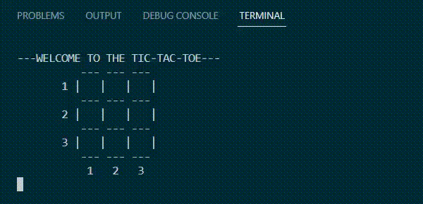

# Tic-Tac-Toe

## General info
This project is a simple console Tic Tac Toe game in C++ with an AI opponent for a human player.
This AI considers all possible game scenarios and makes the optimal move using the Minimax Algorithm.



## Setup
To clone and run this game:
```
$ git clone https://github.com/juliakoban/Tic-Tac-Toe.git
$ cd Tic-Tac-Toe
$ g++ ticTacToe.cpp

```
